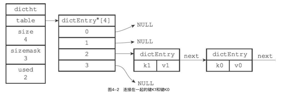
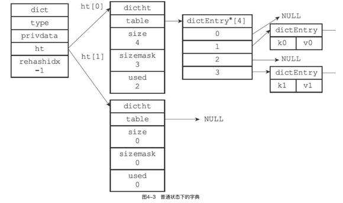
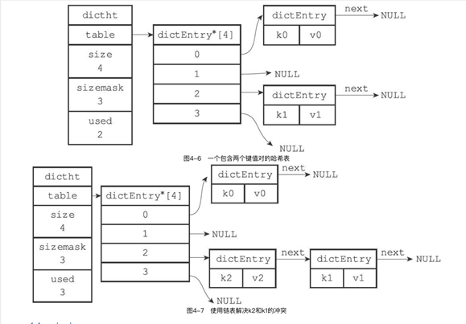

# 《Redis设计与实现》笔记

Redis设计与实现笔记。

# 第 2 章：简单动态字符串

redis中没有使用c语言中传统的字符串表示方法，自定义了字符串的表示 简单动态字符串，简称为SDS.

**用途：redis中所有有关于字符串的都是`sdshdr`实现的**

## `sdshdr`

```c
struct sdshdr
{
    int len;    // 记录buf数组中已经保存的字符串长度
    int free;   // buf数组中未使用的字节数量
    char buf[]; // 字节数组，用来保存字符串
};
```

### 特点

1. 常数复杂度获取字符串长度
   1. 因为有len实时记录
   2. 时间复杂度从O(N)降低到了O(1)
2. 杜绝缓冲区溢出
   1. 传统的c字符串 strcat 拼接命令没有检查 dest 是否有足够的内存，需要程序员自己保证
   2. SDS如果需要进行修改时，首先会判断空间是否符合要求，如果不符合，API会自动将SDS的空间扩展至执行修改所需要的大小，所以就杜绝了缓冲区溢出.
3. 减少修改字符串时带来的内存重新分配的次数
   1. 原生的C语言字符串可能产生缓冲区溢出、内存泄漏
   2. redis作为内存数据库，所以要求比较严苛，所以SDS通过未使用空间解除了字符串长度和底层数组长度之间的关联。
      1. SDS 中，buf数组的长度不一定是字符数量加一，数组中可以包含未使用的字节，由free记录
      2. 未使用空间实现了空间预分配和惰性空间释放两种优化策略。
   3. 空间预分配策略
      1. 要对sds进行扩展的时候，不仅会扩展出需要使用的空间，还会额外分配出一些未使用的空间
      2. 如果sds长度小于 1MB ,程序分配和len属性同样大小的未使用空间，这时sds中的len=free
      3. 如果对sds进行修改之后，长度大于等于1MB，则sds会分配1MB的未使用空间.
      4. 通过这种预分配策略，可以有效减少分配次数，提高效率
      5. 这种效率将连续增长的N次字符串所需要的内存重分配次数从必定N次，降低为最多N次
   4. 惰性空间释放策略
      1.  当需要进行空间释放的时候，不立刻使用 free 来释放内存，而是先将这些内存用free记录下来，以便于以后使用
      2. 也提供相应API，用来真正在需要释放的时候，释放空间
4. 二进制安全
   1. C字符串中必须符合按照某种编码(比如ASCII)，并且除了字符串末尾之外，字符串中不能包含空字符
   2. 使用这种二进制安全的SDS，则可以保存二进制数据
5. 兼容部分C字符串函数
   1. 遵循C语言中字符串的一些规定，这些API总会将SDS末尾保存的数据末尾设置为空白字符。且总会在分配空间的时候多分配一个字节的空间来容纳这个空字符。

## C字符串与Redis的主要区别

| C字符串                               | SDS                               |
| ------------------------------------- | --------------------------------- |
| 获取字符串长度复杂度O(N)              | 获取字符串长度复杂度O(1)          |
| API不安全，可能造成缓冲区溢出         | API安全，不会造成缓冲区溢出       |
| 修改字符串必然需要执行N次内存重新分配 | 修改字符串至多执行N次内存重新分配 |
| 只能保存文本数据                      | 二进制安全，可以保存二进制数据    |
| 可以使用<string.h>中的所有函数        | 只兼容一部分<string.h>函数        |

# 第 3 章：链表

链表的定义大家基本都清楚，本章部分主要讲了Redis中的链表实现。
**用途：链表在redis中的用途很广泛，比如列表键的底层实现之一就是链表，除了列表键之外，发布与订阅、慢查询、监视器、也广泛的使用了链表**

## 链表节点的定义

```c
 // adlist.h/listNode
 typedef struct listNode
 {
     struct listNode *prev; //前驱
     struct listNode *next; //后继
     void *value;           //值
 };
```

多个listNode通过prev和next可以组成双端链表.

链表操作定义：

```c
typedef struct list
{
    listNode *head;                     // 表头
    listNode *tail;                     // 表尾
    unsigned long len;                  // 链表所包含的节点数量
    void *(*dup)(void *ptr);            // 节点复制函数
    void *(*free)(void *ptr);           // 节点释放函数
    int (*match)(void *ptr, void *key); // 节点值对比函数
} list;
```

- dup 函数用于复制节点保存的值
-  free 函数用来释放链表节点保存的值
-  match 函数用于对比链表节点值与另一个输入值是否相等.

## redis 实现的链表的特性总结

- 双端：节点都有前驱和后继，获取复杂度都是O(1)
- 无环：表头的前驱和表尾的后继节点都是 NULL
- 带表头指针和表尾指针：通过list中带有的 head和tail，程序获取链表的头和尾复杂度都是O(1)
- 带链表长度计数器:len
- 多态：链表节点用 void* 来保存值，所以链表类型可以保存各种不同种类的值

# 第 4 章：字典

字典，又称为符号表、关联数组或者映射，一般用来保存键值对。

Redis也构建了自己的字典，Redis的数据库就是使用字典来作为底层实现的，对数据库的增删查改都是建立在字典之上的。还有哈希键的底层实现

**用途：数据库、哈希键**

## 哈希表定义

```c
// dict.h/dictht
typedef struct dictht
{
    dictEntry **table;      // 哈希表数组
    unsigned long size;     // 哈希表大小
    unsigned long sizemark; // 哈希表大小掩码，用于计算索引值，总是等于 size-1
    unsigned long used;     // 记录哈希表已有节点数量
};
```

table是一个数组，数组中的每一个元素都指向 dict.h/dictEntry 结构的指针。每个 dictEntry 结构中保存着一个键值对，size 属性记录了哈希表的大小，就是 table 数组的大小，used属性记录了已有键值对的数量，sizemask值总是等于size-1，这个属性和哈希表一起决定一个键应该放到table数组哪个索引上面。

## 哈希表节点定义

```c
typedef struct dictEntry
{
    void *key; // 键
    union {    // 值
        void *val;
        u_int64_t u64;
        int64_t s64;
    } v;
    struct dictEntry *next; //指向下一个哈希节点，形成链表
} dictEntry;
```

- key保存着键值对中的键，v保存着值，键值对的值可以是一个指针，或者一个u_int64_t的整数，或者一个 int64_t 的整数。
- next属性指向聆听一个哈希表节点的指针，这个指针可以将多个哈希值相同的键连在一起，来解决键冲突的问题。



## 字典定义

```c
// dict.h/dict
typedef struct dict
{
    dictType *type; // 类型特定函数
    void *privdata; // 私有数据
    dictht ht[2];   // 哈希表
    int trehashidx; // rehash 索引，当rehash不在进行时，值为-1
} dict;

typedef struct dictType
{
    unsigned int (*hashFunction)(const void *key);    // 计算哈希值的函数
    void *(*keyDup)(void *privdata, const void *key); // 复制键的函数
    void *(*valDup)(void *privdata, const void *obj); // 复制值的函数
    void (*keyDestructor)(void *privdata, void *key); // 销毁键的函数
    void (*valDestructor)(void *privdata, void *obj); // 销毁值的函数
} dictType;
```

- type属性和privdata属性是针对不同类型键值对，为了创建多态字典而设置的：于操作特定类型键值对的函数，redis会为用途不同的字典设置不同的类型特定函数。
- privdata属性保存了需要传给那些类型特定函数的可选参数
- ht数组包含两个哈希表，一般情况下，字典只使用ht[0]，另一个ht[1]只会在对ht[0]进行rehash的时候使用
- rehashidx记录了目前rehash的进度，如果目前没有在进行中的rehash，那么值为-1



## 哈希算法

要将一个新的键值对添加到字典里面时，程序要先根据键值对的键计算出哈希值和索引值，再根据索引求职，将包含新键值对的哈希表节点放在哈希表数组的指定索引上

redis计算索引值的方法如下：

1. 使用字典设置的哈希函数，计算出key的哈希值

2. hash = dict->type->hashFunction(key);

3. 使用哈希表的sizemask属性和哈希值，计算出索引值

4. 根据情况不同,ht[x]可以是ht[0]或ht[1]
5. index = hash & dict->ht[x].sizemask

redis使用 MurmurHash 算法计算哈希值，算法详情见： [Murmur哈希](https://zh.wikipedia.org/zh-sg/Murmur哈希)

## 解决键冲突

当两个或两个以上的键被分配到了哈希表的同一个索引上时，被称为哈希冲突.

redis使用**链地址法**来解决哈希冲突

每个哈希表节点都有一个next指针，多个哈希表节点可以使用next指针来构成一个单向链表，被分配到同一个索引上的节点可以用单项链表连起来，这就解决了哈希冲突的问题。

 

## `Rehash`

随着操作不断进行，哈希表保存的键值对会逐渐的增多或减少，为了让哈希表的负载因子维持在一个合理的范围之内，当哈希表保存的键值对数量太多或者太少时，程序要对哈希表的大小进行相应的扩展和收缩。

rehash步骤：

1. 为字典ht[1]哈希表分配空间，这个哈希表的空间大小取决于要执行的操作，以及ht[0]包含的键值对的数量，就是 ht[0].used 的取值

2. 如果执行扩展操作，那么ht[1]的大小为第一个>=ht[0].used*2的2^n
3. 如果是收缩操作，那么ht[1]的大小为第一个大于等于ht[0].used的2^n
4. 将保存在ht[0]上的键值对rehash到ht[1]上：rehash指的是重新计算哈希值和索引值，然后将键值对放置到ht[1]哈希表的指定位置上。
5. 当ht[0]上的所有键值对都迁移到了ht[1]啥样的对应位置后，释放ht[0]，将ht[1]设置成ht[0]，为下一次rehash做准备

## 哈希表的扩展与收缩

哈希表负载因子：

1.  load_factor = ht[0].used/ht[0].size

程序自动开始对哈希表进行扩展的条件：

1. 服务器没有正在执行的 BGSAVE 或 BGREWRITEAOF 命令，并且 load_factor >= 1

2. 服务器正在执行的 BGSAVE 或 BGREWRITEAOF 命令，并且 load_factor >= 5
   

根据BGSAVE 或 BGREWRITEAOF 命令是否执行，服务器执行扩展所需要的负载因子不同，原因是大多数操作系统都是用 COW(copy-on-write)写时复制技术优化进程使用率，所以子进程存在期间，服务器会提高所需要的负载因子，尽可能避免在子进程存在期间进行扩展，避免不必要的内存写入操作，最大限制节约内存。

当 load_factor < 0.1 时，程序会自动对哈希表执行收缩操作。

## 渐进式 Rehash

为什么需要rehash?

- 哈希表键值对少的时候，可以一次性从ht[0]放到ht1[1]中，但是当键值对特别多时，就需要进行渐进式rehash

rehash的流程?

1. 在字典中维护一个索引计数器变量 rehashidx ，值为-1时代表未开始或已结束，>=0 时代表rehash进行中

2. 在rehash进行期间，每一次对字典的增删查改，程序除了进行指定的操作，还会顺带将ht[0]哈希表rehashidx索引上的所有键值对，rehash到ht[1]

3. 重复这个过程，当ht[0]上所有的键值对都挪到了ht[1]，就完成了整个rehash的过程
   

在进行渐进式rehash的过程中，字典会同时使用ht[0]和ht[1]两个哈希表，如果0没有就回去1上找。

在 rehash 进行过程中，新添加到字典中的键值对一律会保存到ht[1]中，ht[0]不会进行任何添加操作

# 第 5 章：跳跃表

跳跃表是一种有序数据结构，它通过在每个节点中维持多个指向其他节点的指针，从而达到快速访问的目的。

跳跃表平均复杂度为O(logN)、最坏情况下O(N)复杂度的节点查找，还可以通过顺序性操作来批量处理节点。

大部分情况下，跳跃表效率可以和平衡树媲美，并且由于实现简单，不少程序都使用跳跃表来代替平衡树。

**用途：redis中跳跃表只在两个地方被使用到：一个是实现有序集合(`sorted_set`)键，一个是集群节点中用作内部数据结构。**


在redis中，跳跃表由 redis.h/zskiplistNode 和 redis.h/zskiplist 这两个结构定义


zskiplistNode结构用来表示跳跃表节点，而zskiplist结果则用来保存跳跃表节点的相关信息，比如节点的数量，以及指向表头节点和表尾节点的指针等。

## 跳跃表节点定义

```c
#define REDIS_LRU_BITS 24
typedef struct redisObject
{
    unsigned type : 4;     // 类型
    unsigned encoding : 4; // 编码
    // 对象最后一次被访问的时间
    unsigned lru : REDIS_LRU_BITS; /* lru time (relative to server.lruclock) */
    int refcount;                  // 引用计数
    void *ptr;                     // 指向实际值的指针
} robj;

typedef struct zskiplistNode
{
    struct zskiplistNode *backward; // 后退指针
    double score;                   // 分值
    robj *obj;                      // 成员对象
    struct zskiplistLevel
    {
        struct zskiplistNode *forward; // 前进指针
        unsigned int span;             // 跨度
    } level[];
};
```

#### 层

跳跃表节点的level数组可以包含多个元素，每个元素都包含一个指向其他节点的指针，程序可以通过这些层来加快访问其他节点的速度，一般来说，层的数量越多，访问其他节点的速度就越快。


每创建一个新的跳跃表节点的时候，程序都会根据**幂次定律（越大的数出现的概率越小）**随机生成一个介于1和32之间的值作为level数组大小，这个大小就是这个「层」的高度。

#### 前进指针

每个层都有一个指向表尾方向的前进指针，用于从表头向表尾方向访问节点。

#### 跨度

层的跨度用于记录两个节点之间的距离:

- 两个节点之间的跨度越大，它们相距越远

- 指向 NULL 的所有前进指针的跨度都为0，因为它们没有连接任何节点。 

跨度的用途是用来计算排位（Rank）的：在查找某个节点的过程中，将沿途访问过的所有层的跨度累积起来，得到的结果就是目标节点在跳跃表中的排位

#### 后退指针

节点的后退指针用于从表尾向表头访问节点：跟可以一次跳过多个节点的前进指针不同，每个节点只有一个后退指针，所以每次只能倒退到前一个节点。

#### 分值和成员

节点的分值(score属性)：是一个double类型的浮点数，跳跃表中的所有节点都按分值从小到大排序。
节点的成员对象（obj 属性）：是一个指针，指向字符串对象，字符串对象中保存着一个 SDS.

在同一个跳跃表中，各个节点保存的成员患对象必须是唯一的，但是多个节点保存的分值却可以是相同的：分值相同的节点按照对象的字典序来排序.

## 跳跃表

靠多个跳跃表节点就可以组成一个新的跳跃表.

```c
typedef struct zskiplist
{
    // 表头节点和表尾节点
    struct zskiplistNode *header, *tail;
    // 表中节点的数量
    unsigned long length;
    // 表中层数最大的节点的层数
    int level;
} zskiplist;

```

header和tail指针分别代表头部和尾部。通过这两个指针访问头节点和尾节点的复杂度为O(1)

# 第 6 章：整数集合

